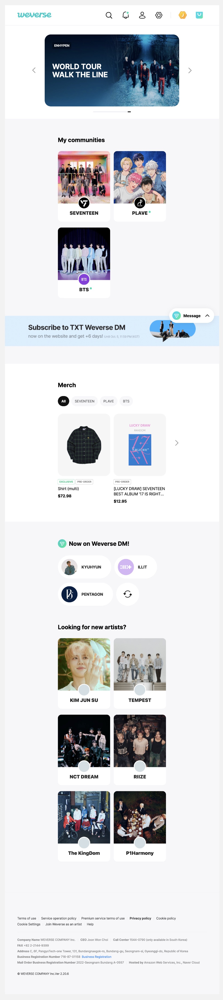
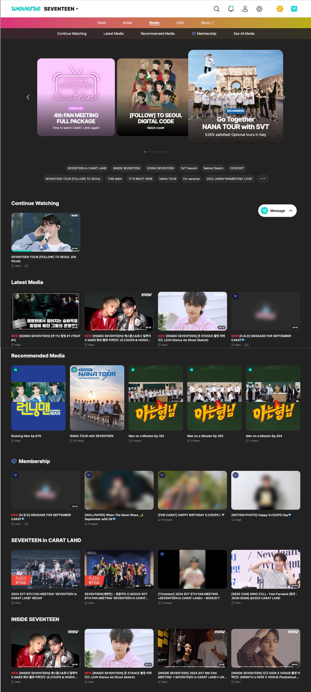
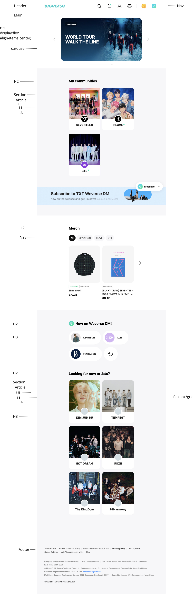
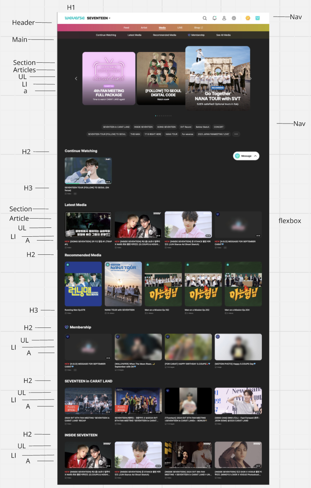
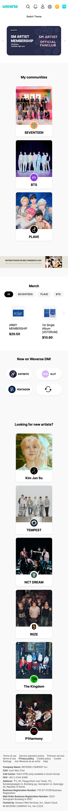
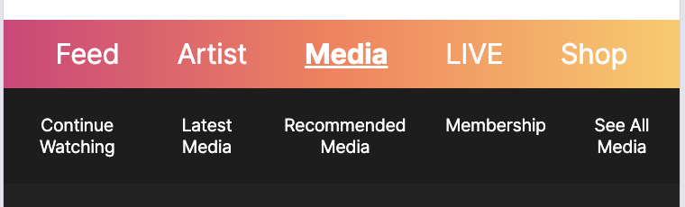
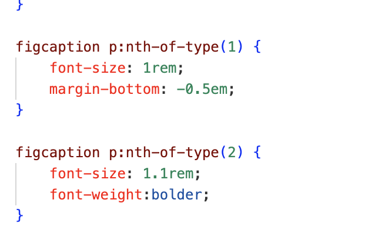
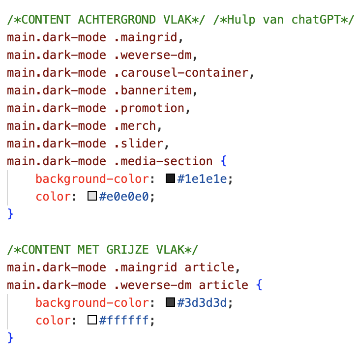

# Procesverslag
Markdown is een simpele manier om HTML te schrijven.  
Markdown cheat cheet: [Hulp bij het schrijven van Markdown](https://github.com/adam-p/markdown-here/wiki/Markdown-Cheatsheet).

Nb. De standaardstructuur en de spartaanse opmaak van de README.md zijn helemaal prima. Het gaat om de inhoud van je procesverslag. Besteedt de tijd voor pracht en praal aan je website.

Nb. Door *open* toe te voegen aan een *details* element kun je deze standaard open zetten. Fijn om dat steeds voor de relevante stuk(ken) te doen.

## Jij

  
uitwerken voor kick-off werkgroep

  ### Auteur:
  Audrey Widjaja

  #### Je startniveau:
  blauw

  #### Je focus:
  surface plane
 

## Je website

  
uitwerken voor kick-off werkgroep

  ### Je opdracht:
  https://weverse.io

  #### Screenshot(s) van de eerste pagina (small screen): 
  Weverse Home 
  

  #### Screenshot(s) van de tweede pagina (small screen):
  Media 
  
 

## Toegankelijkheidstest 1/2 (week 1)

  
uitwerken na test in 2e werkgroep

  ### Bevindingen
  Lijst met je bevindingen die in de test naar voren kwamen:

  - Ik heb eerst de screenreader voice naar Engels moeten instellen, omdat het niet automatisch met een Nederlandse stem gegenereerd werd naar Engels.
  - De context van de promotionele banners op de Home-pagina werd niet benoemd door de screenreader.
  - De foto's voor merchandise en profielen van members hadden geen alt tekst. 

## Breakdownschets (week 1)

  
uitwerken na afloop 3e werkgroep

  ### Home Page: 
  

  ### Media Page: 
  

## Voortgang 1 (week 2)

  
uitwerken voor 1e voortgang

  ### Stand van zaken
  Het was weer even inkomen voor mij om te coderen, ik moest veel dingen weer even opzoeken. De content van de officiële site naar mijn eigen site coderen was wel te doen. 

  ### Agenda voor meeting
  samen met je groepje opstellen

  | Audrey         | Kaylee          | Sharon    | Jelle        |
  | ---            | ---             | ---       | ---      
  |Juiste tags gebruikt? Beter in html of css? Meer headers?|  Svg omzetten? Hoe continu video afspelen?           |No horizontal scroll|              |
  |                |                 |           |              |
  |                |                 |           |              | 
       

     
            

  ### Verslag van meeting
  
Feedback 1ste voortgangsgesprek:
HTML/Code: Nette semantische code en ook al goed ingesprongen. Mooi dat je header al werkt, je zou eventueel alles in 1 nav kunnen zetten. Mooie oplossing voor de H1, doordat je deze op display none zet!

## Voortgang 2 (week 3)

  
uitwerken voor 2e voortgang

  ### Stand van zaken
  Ik ben verder gekomen met de html en css, alleen heb ik nog struggles met bepaalde details zoals het uitwerken van de carousel. 

  ### Agenda voor meeting
  samen met je groepje opstellen

  | Audrey     | student 2          | student 3    |       |
  | ---            | ---                | ---          | ---              |
  | Teveel classes?  | Class gebruik            | surface plane   |
  | Carousel? | dit als er tijd is | nog een punt | dit wil ik zeker |
  | div gebruik?           | ...                | ...          |

  ### Verslag van meeting
  hier na afloop snel de uitkomsten van de meeting vastleggen

  - Carousel hulpmiddel gekregen via Teams. 
  - Geen px gebruiken.
  - Comments toevoegen in CSS.
- ...

## Toegankelijkheidstest 2/2 (week 4)

  
uitwerken na test in 9e werkgroep

  ### Bevindingen
  Lijst met je bevindingen die in de test naar voren kwamen (geef ook aan wat er verbeterd is):

  - Screenreader las niet alles voor en skipte belangrijke elementen. (Heb aria-labels gegeven)
  - Lay-out van de merch section klopte nog niet helemaal op de website. (Gefixt met css)

## Voortgang 3 (week 4)

  
uitwerken voor 3e voortgang

  ### Stand van zaken
  Vanwege omstandigheden heb ik niet zover kunnen komen zoals ik zou willen, en valt er nog wat te doen. De website ziet er wel gewoon goed uit, alleen vraag ik me af of het goed genoeg is kwa ruimtegebruik. 

  ### Agenda voor meeting
  samen met je groepje opstellen

  | Audrey      | Kaylee         | Bibi    |        |
  | ---            | ---                | ---          | ---              |
  | animaties  |live servers            | javascript   |     |
  | ruimtegebruik? | | |  |
  | mag strongtag html?           |      |         |              |

  ### Verslag van meeting
  hier na afloop snel de uitkomsten van de meeting vastleggen

  - Ideeën voor surface plane:
Geluid wanneer je op knop drukt
Custom properties
Preverse reduced motion
Wanneer scrollen wordt image hoger

- Na de meeting ben ik ook gaan twijfelen over het kiezen van surface plane of toch responsiveness, aangezien ik nog niet eraan was begonnen en responsiveness me eigenlijk meer aanspreekt. 

## Eindgesprek (week 5)

  
uitwerken voor eindgesprek

  ### Je uitkomst - karakteristiek screenshots:
  
  

  ### Dit ging goed/Heb ik geleerd: 
  Ik heb veel geleerd over het gebruik van verschillende html elementen waar ik eerst nog niet veel over wist. Ik heb interessante kleine onderdelen geleerd zoals waar je bijvoorbeeld aria-label voor kan gebruiken, of dat ik meerdere navigaties onder een header kan zetten. Ook heb ik geleerd om efficiënter te coderen door zoveel mogelijk "nth-of-type" te gebruiken. 

  
  

  ### Dit was lastig/Is niet gelukt:
  Ik vond het lastig om het scrollen eerst voor elkaar te krijgen. Uiteindelijk is het wel gelukt door steeds iets anders te proberen. Ik vond het ook lastig om nieuwe dingen te proberen in javascript, zoals dus het scrollen en het volledig mooi krijgen van de darkmode. Het was lastig om de dingen te stijlen zoals ik het wilde hebben in darkmode. Uiteindelijk heb ik ook de button voor switch dark/light mode een andere look gegeven dan dat ik eerst wou hebben. 

  

## Bronnenlijst

  
continu bijhouden terwijl je werkt

  Nb. Wees specifiek ('css-tricks' als bron is bijv. niet specifiek genoeg). 
  Nb. ChatGpT en andere AI horen er ook bij.
  Nb. Vermeld de bronnen ook in je code.

  1. chatgpt.com (in het algemeen gebruik om te vragen hoe ik iets kon fixen wanneer het niet werkte. Staat specifiek verwezen in mijn code.)
  2. w3schools.com (Voor extra surface plane code zoals darkmode)
  3. Hulp van student-assistenten voor minor fixations zoals header layout fixen. 

